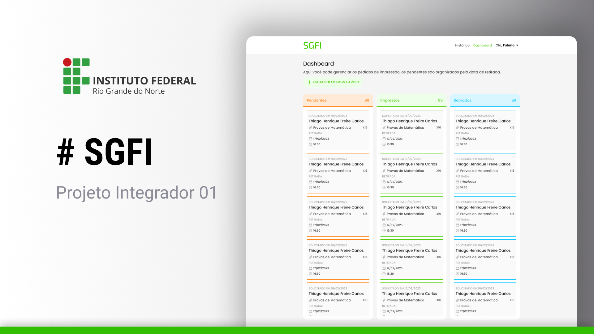

<h1 align="center">
    Sistema de Gerenciamento da Fila de Impressão
</h1>

<p align="center">
  <a href="#-tech">Tecnologias</a>&nbsp;&nbsp;&nbsp;|&nbsp;&nbsp;&nbsp;
  <a href="#-project">Projeto</a>&nbsp;&nbsp;|&nbsp;&nbsp;&nbsp;
  <a href="#-run">Como executar</a>&nbsp;&nbsp;|&nbsp;&nbsp;&nbsp;
  <a href="#-extras">Extras</a>&nbsp;&nbsp;
</p>

<p align="center">
  
</p>

## 📂 Tecnologias

Esse projeto está sendo desenvolvido com:

- [Django](https://www.djangoproject.com/)

## 🚀 Projeto

Um dashboard onde um(a) admininstrador(a) do setor de impressões poderá gerenciar as solicitações dos professores e gerar avisos via e-mail, melhorando a comunicação do setor.


## ⏩ Como executar

Para rodar esse projeto é necessário que tenha o Python instalado na sua máquina.

O passo-a-passo abaixo é para Linux.

1 - Primeiro, clone o projeto e crie um virtual env para instalar as dependências

```bash
git clone https://github.com/RenanMaestrya/SGFI.git
cd SGFI
python -m venv .venv
source .venv/bin/activate
pip install -r requirements.txt
```

2 - Agora, migre os dados do banco de dados e rode o projeto
```bash
python manage.py migrate
python manage.py runserver
```

3 - Por fim, o projeto estará rodando, por padrão, em http://localhost:8000/

## 🔎 Extras

Esse projeto tem como objetivo cumprir os requisitos para concluir o primeiro projeto integrador do quarto semestre de Análise e Desenvolvimento de Sistemas no IFRN - Campus Pau dos Ferros.


